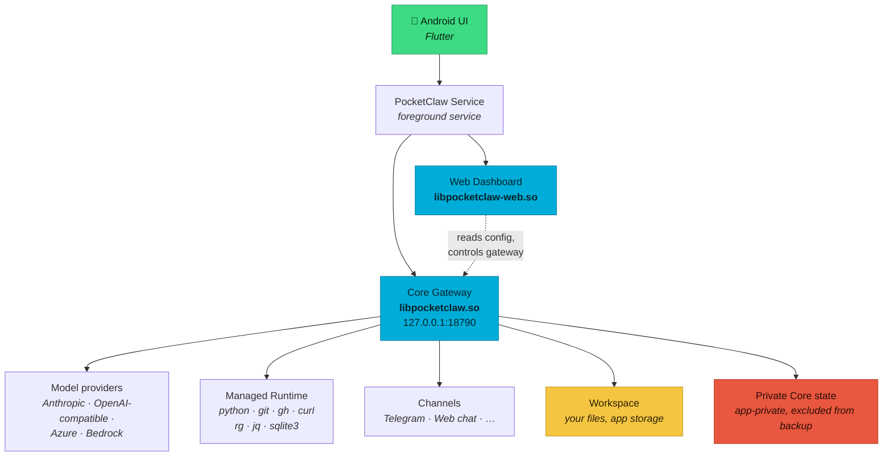

<div align="center">


# PocketClaw

**A private AI agent that runs on your Android phone — not on someone else's server.**

The model is remote. Everything else — the gateway, the tools, the workspace,
the credentials — lives on the device you are holding.

<br />

[](https://github.com/Lord1Egypt/PocketClaw/releases/download/v0.2.3/PocketClaw-v0.2.3-arm64-v8a.apk)

| Latest stable | Android | Architecture | Status | Distribution |
| :---: | :---: | :---: | :---: | :---: |
| [**v0.2.3**](https://github.com/Lord1Egypt/PocketClaw/releases/tag/v0.2.3) | 8.0+ (API 26+) | arm64-v8a | Stable | GitHub Release |

<br />

[](https://github.com/Lord1Egypt/PocketClaw/actions/workflows/release-gate.yml)
[](https://github.com/Lord1Egypt/PocketClaw/releases/latest)
[](https://github.com/Lord1Egypt/PocketClaw/releases/latest)


-555555)

<br />


[](LICENSE)
<br />
[](https://github.com/Lord1Egypt/PocketClaw/stargazers)
[](https://github.com/Lord1Egypt/PocketClaw/commits/main)
[](https://github.com/Lord1Egypt/PocketClaw/issues)

</div>

---

## Download

**[PocketClaw v0.2.3 — arm64-v8a APK](https://github.com/Lord1Egypt/PocketClaw/releases/download/v0.2.3/PocketClaw-v0.2.3-arm64-v8a.apk)** · [release page](https://github.com/Lord1Egypt/PocketClaw/releases/tag/v0.2.3)

`PocketClaw-v0.2.3-arm64-v8a.apk` — 58,441,695 bytes — SHA-256
`778882828e2f818aac31ed1f58dd3b2e8530828970b535ce72564f5ed2857599`

An `arm64-v8a` Android device on **Android 8.0 (API 26)** or newer, and an API
key for a model provider. Built and physically validated on Android 16.

<details>
<summary><b>Verify what you downloaded</b></summary>

<br />

Both files are on the release page. Check the APK against the checksum file:

```bash
sha256sum -c SHA256SUMS.txt
```

```
778882828e2f818aac31ed1f58dd3b2e8530828970b535ce72564f5ed2857599  PocketClaw-v0.2.3-arm64-v8a.apk
```

And confirm it was signed by the PocketClaw release key — a checksum proves the
file is intact, the signature proves who built it:

```bash
apksigner verify --print-certs PocketClaw-v0.2.3-arm64-v8a.apk
```

```
Signer #1 certificate SHA-256 digest: 176dca6b198b9552fb4d9ad3ca18da8d6f23c0a3f5ed4bd6b75a0700f9f0efcf
```

That fingerprint is the public half of the signing key and is committed to this
repository at [`android/release-signing-cert.sha256`](android/release-signing-cert.sha256).
An APK that does not show it was not built by this project.

</details>

---

## What it is

PocketClaw packages a full agent runtime into a single Android app. It ships its
own Go gateway, a web dashboard, and a set of real command-line tools compiled
for `arm64-v8a`, so the agent can clone a repository, run a Python script, query
a SQLite database or call an API **on the phone**, without a build server or a
developer machine in the loop.

You bring an API key for whichever model provider you prefer. PocketClaw brings
everything around it.

## Capabilities

| | |
| --- | --- |
| **On-device gateway** | A Go binary bound to loopback only. Nothing listens to the network on your behalf. Lightweight background Core: about 20 MB PSS while idle and roughly 26–33 MB during active agent work on our Android 16 test device. The app's screens and web view use more while open. |
| **Managed Runtime** | Eight real arm64 tools, version-pinned and shipped in the APK. PocketClaw never downloads its runtime; the tools use the network only for work you ask the agent to do. |
| **Web dashboard** | A local console for providers, channels, skills, models and logs, in 14 locales. |
| **Telegram** | Guided managed-bot onboarding, or a manual bot token if you prefer. |
| **Chat** | Talk to the agent in the app, or over the built-in web channel. |
| **Workspace** | A real directory the agent reads and writes, in the app's own storage (`Android/data/com.lord1egypt.pocketclaw/files/pocketclaw`). PocketClaw asks for no storage permission. A workspace an older version left in `Download/pocketclaw` is never touched, and can be copied in from Settings. |
| **Skills** | Reusable prompt/tooling bundles the agent can load per task, and find or install from the ClawHub registry or GitHub when you ask. |
| **12-locale app** | Full app translation, right-to-left included. |

### Managed Runtime — what actually ships

Version-pinned, compiled for `arm64-v8a`, extracted from the APK at install
time. Nothing is downloaded to install or update them, and there is no
toolchain on the device. They reach the network only when the agent uses them
for something you asked — PocketClaw is not an offline app: the model runs at
the provider you choose.

| Tool | Version | Tool | Version |
| --- | --- | --- | --- |
| `python` | 3.14.7 | `git` | 2.51.0 |
| `gh` | 2.101.0 | `curl` | 8.11.1 |
| `rg` | 14.1.1 | `sqlite3` | 3.50.4 |
| `jq` | 1.7.1 | `git-remote-http` | (with `git`) |

### Model providers

Anthropic (both the Messages API and the classic surface), OpenAI-compatible
endpoints, OpenAI Responses, Azure OpenAI, AWS Bedrock, and a CLI provider for
locally reachable models.

### Channels you can configure

`pocketclaw` (the native realtime channel), `telegram`, `discord`, `slack`,
`matrix`, `irc`, `mqtt`, `qq`, `wecom`, `weixin`, `feishu`, `dingtalk`, `line`,
`onebot`, `maixcam`.

> Available is not the same as first-class. Telegram and the built-in web chat
> are the two paths the app itself guides you through; the rest are configured
> from the dashboard.
>
> WhatsApp is not among them. It is not offered in the app or the dashboard and
> is not part of this release.

## How it works



The gateway is the only component that talks to a model. The UI, the dashboard
and every channel reach it through the same local socket, which is why the agent
behaves identically whether you type in the app, message it on Telegram, or open
the dashboard on your laptop.

## Quick start

1. Install the APK.
2. Open PocketClaw and press **Start**. The gateway comes up on loopback.
3. Open the **Dashboard** and add your provider API key.
4. Chat in the app, or connect Telegram from **Settings → Channels**.

Telegram setup is one tap: PocketClaw creates your own bot for you. There is no
token to copy, and only your own account can talk to it.

## Security and privacy design

This is the part worth reading before you trust an agent with a shell.

- **The gateway is loopback-only.** It binds `127.0.0.1:18790` and `[::1]:18790`.
  Android does not isolate loopback between apps, which is exactly why the
  gateway credential is not where another app could read it.
- **Credentials live in app-private, no-backup storage.** The gateway bearer
  token, the dashboard auth database and the Core logs are outside shared
  storage and excluded from Android backup and device transfer.
- **The GitHub token is sealed by the Android Keystore** under a
  non-exportable key, decrypted only when the service builds the Core
  environment, and never exposed to the agent.
- **The dashboard session cookie is `HttpOnly`, `SameSite=Lax`, host-only**, and
  backed by a server-side session store — the cookie alone is not a credential.
- **Logs are redacted at the source.** Keys, tokens and message text never reach
  a log line, however deeply they are nested in a structured field.
- **Your workspace stays yours.** Seeded once, then owned by you; upgrades never
  rewrite your files.

<details>
<summary><b>Build and verification guarantees</b></summary>

<br />

The two native binaries are reproducible and provenance-stamped:

- One **source fingerprint** covers every input to both shipping binaries — the
  Go gateway *and* the dashboard, including the frontend sources that become its
  embedded bundle. Both binaries carry that fingerprint, and the release gate
  fails if either is stale.
- **Builds are deterministic.** The build timestamp is derived from the last
  commit that touched a real build input, never the wall clock, so the same
  source produces byte-identical binaries.
- **`tool/release_gate.py` decides what "releasable" means**, and the same
  command runs in CI and on a developer machine, so the two cannot disagree.
- **`tool/no_active_pico.py`** enforces the namespace policy on every gate run.
- **Signing is owner-held.** The keystore and its passwords live outside this
  repository and are never in CI; only the public certificate fingerprint is
  committed, and the gate fails closed if an artifact does not carry it.

This release is tag `v0.2.3` at commit
[`ee68747`](https://github.com/Lord1Egypt/PocketClaw/commit/ee68747ba385d59f9719b475b98e298825899717).
Its APK (58,441,695 bytes) carries Core fingerprint `cac3e443…` (built with
go1.26.8), Dart AOT `f8088d17…`, bundled `gh` 2.101.0 `0a660a0b…` and `git`
`60d3a1c0…`. It was built in F-Droid's buildserver layout by
[`tool/canonical_release_build.py`](tool/canonical_release_build.py): three
clean builds — two of the build commit
[`7c0980c`](https://github.com/Lord1Egypt/PocketClaw/commit/7c0980ca851adc5d79985433d72b5207186a1ffa)
and one of the tagged commit — produced the identical unsigned APK
`e09340e7…`, which the owner signed without rebuilding. The tagged commit adds
only documentation, the acceptance record, the accepted-build baseline and the
merge on top of the build commit.
Earlier releases, v0.2.1 included, stay on their
[release pages](https://github.com/Lord1Egypt/PocketClaw/releases).

</details>

## Development

```bash
# Flutter app
flutter pub get
flutter analyze lib/ test/
flutter test

# Core (Go) — the shipped arm64 binaries
./core/build-android-arm64.sh

# Release APK
cd android && ./gradlew :app:assembleRelease -Ptarget-platform=android-arm64

# What "releasable" means, in one command
python3 tool/release_gate.py --verify-source --release-class production
```

Never commit generated APKs, tool caches, signing material, or
provider/Telegram/Firebase credentials.

> **Note on branches.** `develop` is the active branch; `main` and `develop` both
> carry the released source, and the `v0.2.3` tag points at their shared merge commit.
> Work from `develop`.

## Project status

**Released.** `v0.2.3` (build 65), stable, "Golden #4": a security and
build-hardening release — Core built with Go 1.26.8 and patched libraries, the
bundled GitHub CLI updated to 2.101.0, and every binary built from source in
F-Droid's pinned build environment, where the release reproduces byte for byte.
Physically accepted on a Samsung SM-A165F running Android 16 and published as a
production-signed `arm64-v8a` APK. PocketClaw is not yet listed on F-Droid. The
previous release, `v0.2.2` (build 64), was a reliability and cleanup release.

Binary hardening is complete: Dart obfuscation with private split debug info,
R8 shrinking and obfuscation, and a native/ELF audit covering every packaged
binary — all enforced by the release gate rather than asserted.

**Not in this release.** Account-login credential management — Google, Claude
subscription and ChatGPT/Codex sign-in — is deliberately deferred. Provider
access in v0.2.3 is configured with API keys through **Models**.

Known open items are tracked in [`docs/DEFECT_LOG.md`](docs/DEFECT_LOG.md); the
phase sequence is in [`docs/ROADMAP.md`](docs/ROADMAP.md). Engineering agents and
maintainers should begin with [`docs/AI_HANDOFF.md`](docs/AI_HANDOFF.md), which
defines the repository read order and milestone protocol.

## Contributing

See [`CONTRIBUTING.md`](CONTRIBUTING.md). For anything security-related, read
[`SECURITY.md`](SECURITY.md) first — please do not open a public issue.

## Upstream and attribution

PocketClaw is an independent product built on **PicoClaw**, an MIT-licensed
project by Sipeed. The Android/Flutter foundation selectively adapts PicoClaw
FUI, and PocketClaw vendors PicoClaw Core into [`core/src/`](core/src/) at
upstream release `v0.3.1`, building the shipped binaries from that tree with its
own modifications applied on top.

This is not a Git fork and it does not merge upstream history. Full attribution,
upstream commits and licence texts are in
[`THIRD_PARTY_NOTICES.md`](THIRD_PARTY_NOTICES.md),
[`UPSTREAM_BASELINE.md`](UPSTREAM_BASELINE.md) and
[`licenses/`](licenses/).

## Licence

PocketClaw's own code is [MIT licensed](LICENSE). Third-party and upstream
components keep their own licences and copyright notices — see
[`THIRD_PARTY_NOTICES.md`](THIRD_PARTY_NOTICES.md) and [`licenses/`](licenses/).

<div align="center">
<br />
<sub>Built for people who would rather their agent ran on their own hardware.</sub>
</div>
